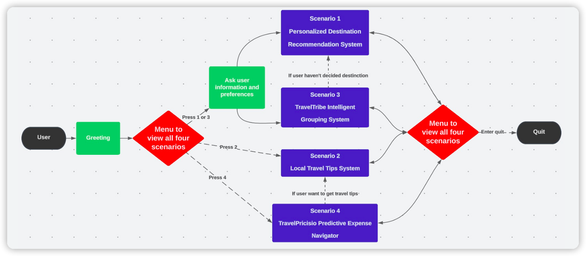
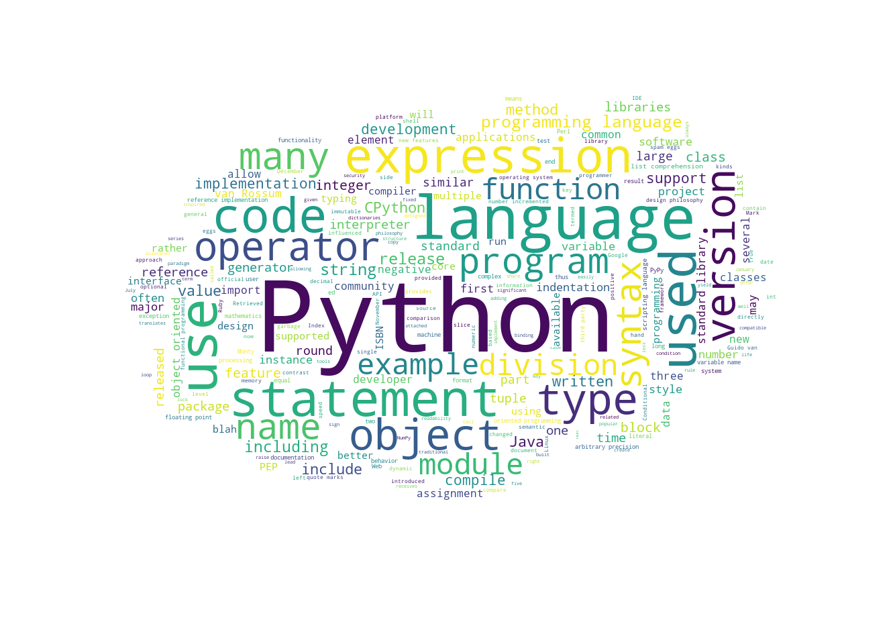

# Chatbot - Concord Travel Agency

Team: Hongyi Zhan, Ge Gao, Yanhuan Huang

## Overview

Centered on addressing three fundamental aspects of travel, this project aimed to create a Chatbot for Concord, a Montreal-based travel agency. The objective was to enhance the existing website services by offering personalized customization through the Chatbot. We employed a variety of machine learning techniques to integrate four scenarios, all designed to elevate the overall customer experience.

## Data Description

The solution drew from 4 datasets: customer preferences, travel cost specifics, airfare trends, and destination insights. 
Customer data was built using a Python package called Faker and has the following information to be matched with destination characteristics:
- Temperature
- Budget
- Purpose
- Language
- Travel with or without Families

Additionally, the dataset incorporated supplementary information to facilitate matching with like-minded travelers:
- Gender
- Age
- Preferred Destination Category
- Travel Months
- Transportation
- Hobby
- Number of People Traveling Together

## Scenario Description
#### Scenario 1: Recommendation on destination
In this scenario, we compare the similarity between customer preference and city characteristics through **Euclidean distance metric**. We then recommend a destination city with the highest similarity to  customers. By doing so, we allow customers to search for any places that they may be interested in, and so to fulfill **the purpose of exploration and discovery**.
#### Scenario 2:  Travel tips
In this scenario, we provide travel tips to customers based on their selections. We offer users to search for general, transportation, culture, language, weather, photography spots, shopping, tipping, and internet tips. This allows the chatbot to develop following **the purpose of culture enrichment**.
#### Scenario 3: TravelTribe Intelligent Grouping System
This scenario helps customers to connect with other travelers who have similar travel habits. It utilizes advanced algorithms, specifically **K-means clustering**, to intelligently group participants based on their personal preferences across various aspects of travel. This enables the creation of well-matched travel companionships to minimize conflicts during the trip, fulfilling **the purpose of building relationships and connections**.
#### Scenario 4: TravelPricisio Predictive Expense Navigator
After we implement scenarios to fulfill the three primary purposes of travel, we also give estimated travel costs for our customers to help them plan their budgets. It combines sophisticated time series analysis using **ARIMA models** for airfare prediction and the visualization power of pie charts to create a robust platform.

## Design Structure

## Team contribution
- **HONGYI ZHAN (TravelTribe & TravelPricisio Lead):** Spearheading the creation of the TravelTribe Intelligent Grouping System, an innovative platform that leverages data intelligence to cluster like-minded travelers. This feature enhances social engagement by facilitating the formation of travel tribes based on shared interests, preferences, and past travel experiences. Simultaneously, I led the development of the TravelPricisio Predictive Expense Navigator, a cutting-edge tool that employs predictive analytics to offer users accurate estimations of their travel expenses. This predictive capability enables travelers to plan their budgets meticulously, ensuring a more organized and stress-free journey.

- **Sharry (Data & Business Insights Lead):** Taking charge of the data collection process, diligently sourcing, organizing, and curating extensive datasets related to travel destinations, user behavior, and preferences. Beyond data management, providing invaluable business insights by analyzing this wealth of information. These insights drive strategic decisions, shaping feature prioritization, marketing strategies, and user engagement tactics. Your work is instrumental in aligning our chatbot project with user needs and market trends.

- **Gao Ge (Destination Recommendations & Travel Tips Lead):** Pioneering the development of the Destination Recommendations module, crafting a sophisticated recommendation engine that delivers personalized travel suggestions to users. This system considers an array of factors, including user preferences, historical travel data, and emerging trends, offering travelers tailored recommendations that enhance their overall experience. Additionally, leading the creation of the Travel Tips feature, which provides users with a treasure trove of expert advice, ranging from packing hacks to local customs and cultural insights. Your contributions elevate our chatbot into a comprehensive travel companion.

## Libraries Used

- **Pandas**

Restructured raw datasets

- **Matplotlib & Wordcloud**

Visualized analysis results and plotted findings using line chart, pie chart and word cloud

- **Scikit-learn**

Performed K-means clustering in the process of traveller companion pairing

- **Statsmodel**

Performed ARIMA model fitting in the process of costs estimation

- **IPython.display**

Created rich and interactive content and displayed External HTML Files

